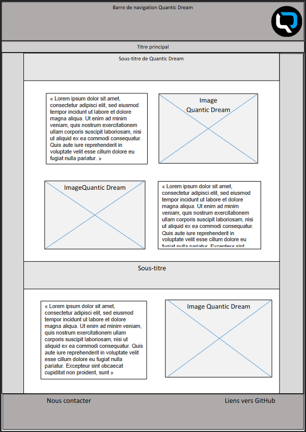
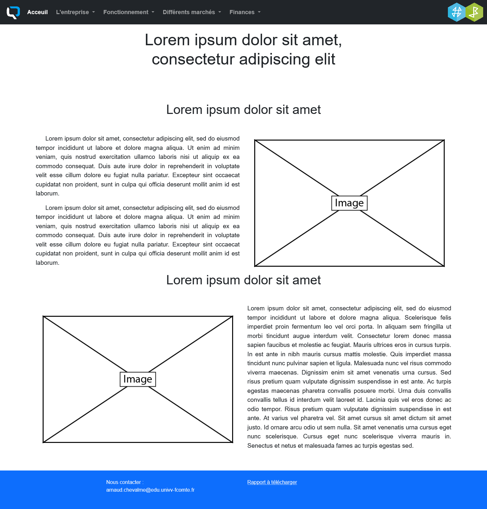

# SAE-S1.06-B2

S1-B2 :
Maxime CRAYSSAC
Gabin BLONDIEAU
Alida GANSANE
Nicolas PICOT
Arnaud CHEVALME

[CHEVALME Arnaud](mailto:arnaud.chevalme@edu.univ-fcomte.fr?subject=[SAE]Sujet)

Pour cette SAÉ 1.06, nous avons choisi l'entreprise Quantic Dream car nous étions déjà tous famillier avec leur production. Pour ce qui est du design, nous nous sommes ispiré des couleurs du logo de Quantic Dream que nous avons apliqué à l'ensemble de nos rendus. 
Nous voulions une barre de navigation simple et intuitive applicable aux différentes pages du site. Ensuite nous voulions que tout les différents contenus tiennent dans deux colonnes différentes, altérnant texte et image, pour une question d'esthétisme et de lisibilité. Et enfin un pied de page pour pouvoir nous contacter. 

# Livrable parties Économie et Documents numérique
[Rapport](doc/CHEVALME_SAES106_B2_QuanticDream.pdf)

# Page d'accueil du site :
[Acceuil Site](https://achevalm-iut90.github.io/SAE-S1.06-B2-QUANTIC-DREAM/accueil.html)
